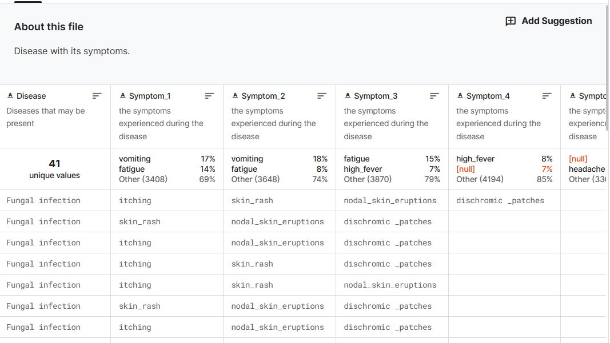
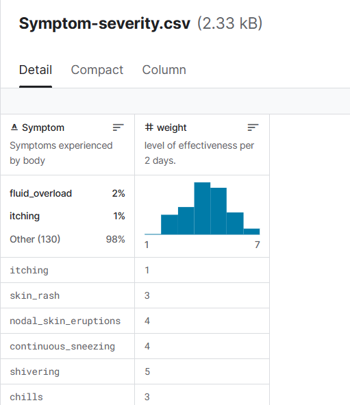
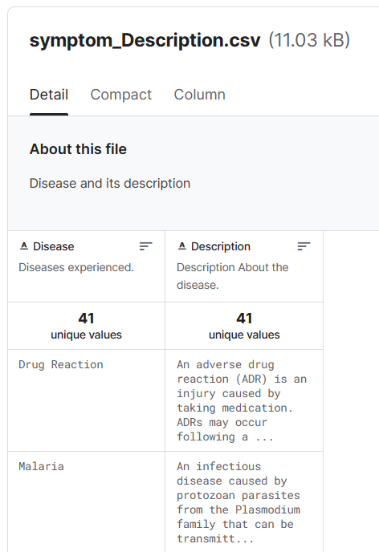
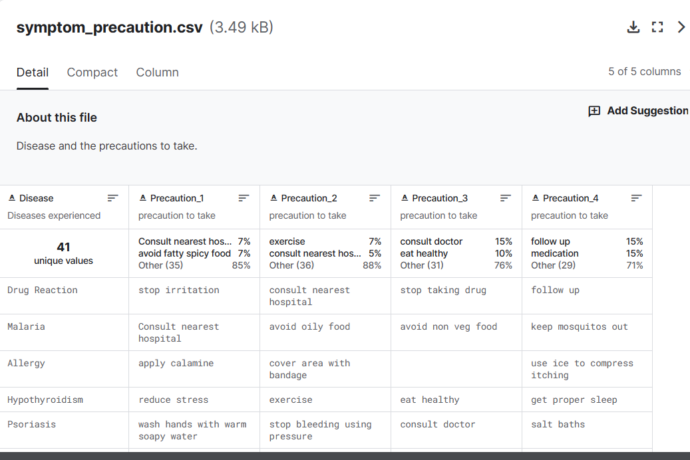

# this folder is for the final project, a disease chatbot.

# motivation:

+ In the region with limited medical resources,, users can conduct preliminary diagnositcs themselves before undergoing further diagnostic procedures with a doctor. This can help alleviate the strain on medicla services and improve efficiency in the healthcare reception desk. 

+ It's also an extension of online helthcare. While awaiting consultation with an online doctor or specialist, users can engage with a guiding chatbot obtain basic diagnostic information. This information will expedite the diagnostic process by providing potential diseases or conditions to the doctor, thus enhancing their understanding of the patient's situation.

+Some individuals are lazy or stubborn, and they may avoid going to the hospital even when they feel unwell. This system can assist them by providing alerts and reminders.

# Chatbot：

+ the chatbot design doesn't need to be very complex, as doctors and the hosplitals follow a specific diagnostic pattern. In Chinese, it's referred to as "ask, smell, observe, and touch". This process involves obtaining basic physical information from users. With this information, doctors will decide whehter further biological checks are necessary or just give out the conclusions. 

+ And based on this information, the chatbot can also provide medical guidance to suers, such as information about available hispital, their operating hours, recommended doctors and assistance with making appointments. 

# dataset used in this project:
There are columns containing diseases, their symptoms , precautions to be taken, and their weights.

[disease-symptoms.csv](https://www.kaggle.com/datasets/itachi9604/disease-symptom-description-dataset/data)

# Model

