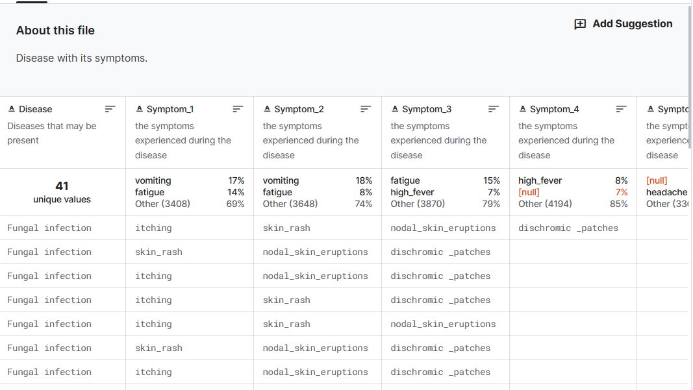
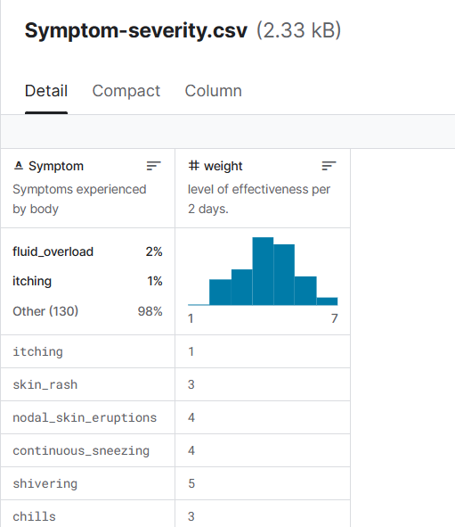
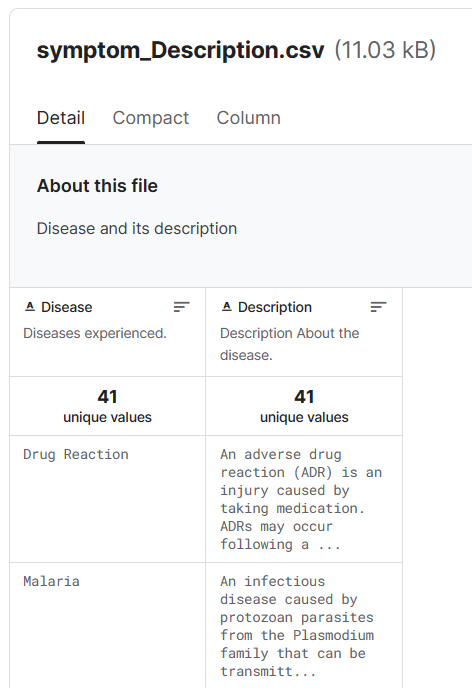
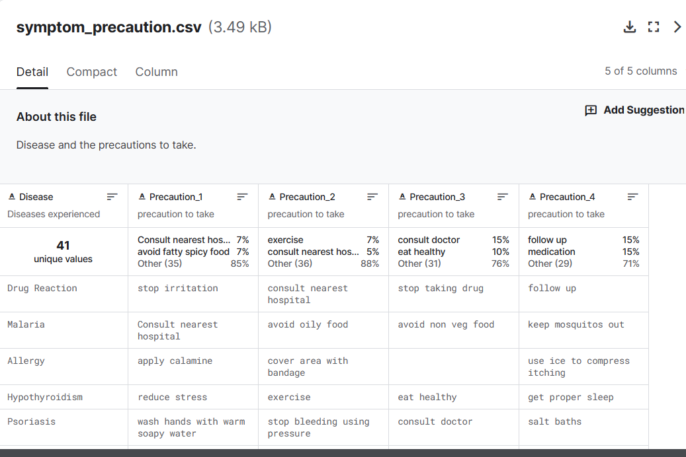

# this folder is for the final project, a disease chatbot.

# motivation:
<!-- + 在医疗人员缺乏的地方，用户可以先行诊断，再根据诊断 进行分流，减少医疗接待区的服务压力和效率。 -->
+ In the region with limited medical resources,, users can conduct preliminary diagnositcs themselves before undergoing further diagnostic procedures with a doctor. This can help alleviate the strain on medicla services and improve efficiency in the healthcare reception desk. 

<!-- + 对线上医疗的一个扩展，再等待线上医生诊断的时候，可以由系统先进行对话，获得基本诊断情况，在分配到医生后，加速医生对病人情况的了解程度，并且给出 潜在的方向 -->
+ It's also an extension of online helthcare. While awaiting consultation with an online doctor or specialist, users can engage with a guiding chatbot obtain basic diagnostic information. This information will expedite the diagnostic process by providing potential diseases or conditions to the doctor, thus enhancing their understanding of the patient's situation.

<!-- + 有些人很懒，那怕能去看，也不愿意去看， 可以用来提醒预警他们 -->

+Some individuals are lazy or stubborn, and they may avoid going to the hospital even when they feel unwell. This system can assist them by providing alerts and reminders.

# Chatbot：
<!-- + 不需要很复杂，医院和医生其实有一个特定的问诊模式，用中国的一句话讲就是 问闻望切， 就是 通过一系列询问获取用户身体基本情况，再根据这个情况做基本判断，进一步详细检查 或者 做出结论。  -->

+ the chatbot design doesn't need to be very complex, as doctors and the hosplitals follow a specific diagnostic pattern. In Chinese, it's referred to as "ask, smell, observe, and touch". This process involves obtaining basic physical information from users. With this information, doctors will decide whehter further biological checks are necessary or just give out the conclusions. 

<!-- + 根据这个情况 最后 给出 就医指导， 比如 附件有哪些医院，在什么时候开门，哪些医生推荐，是否预约。等 -->

+ And based on this information, the chatbot can also provide medical guidance to suers, such as information about available hispital, their operating hours, recommended doctors and assistance with making appointments. 

# dataset used in this project:
There are columns containing diseases, their symptoms , precautions to be taken, and their weights.

[disease-symptoms.csv](https://www.kaggle.com/datasets/itachi9604/disease-symptom-description-dataset/data)

